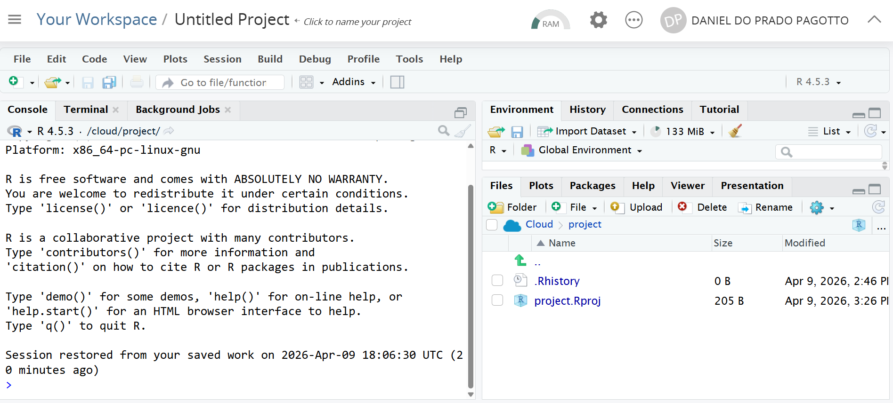
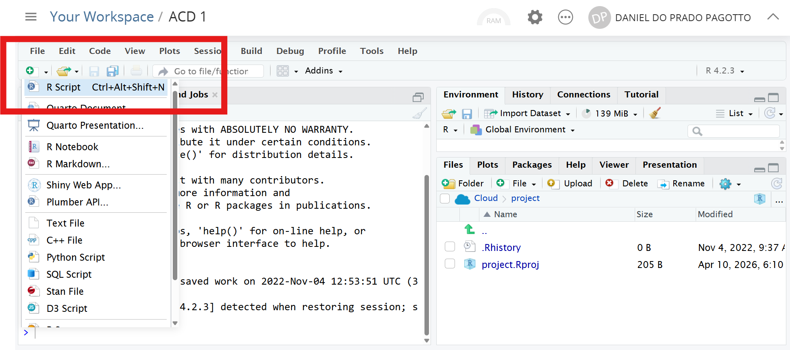
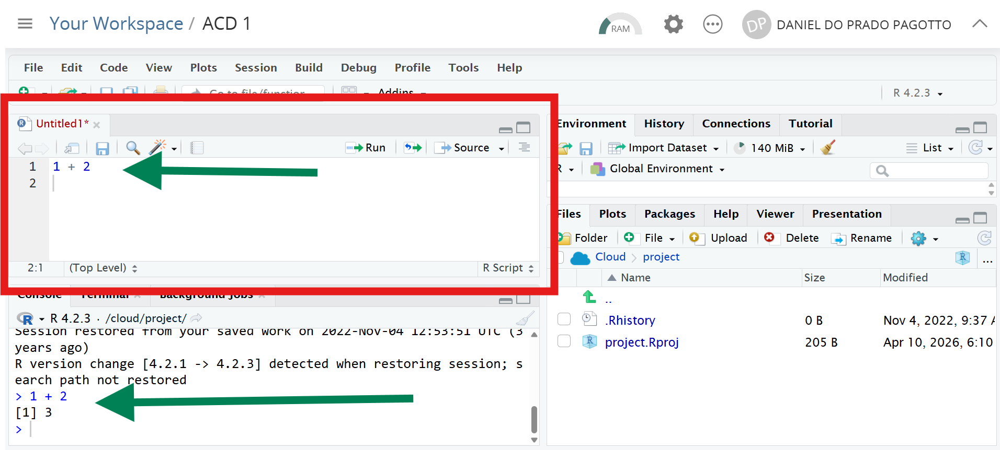
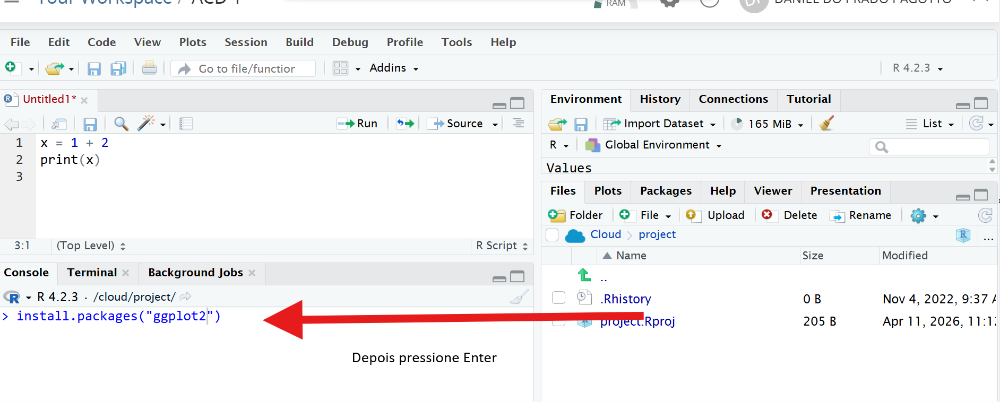
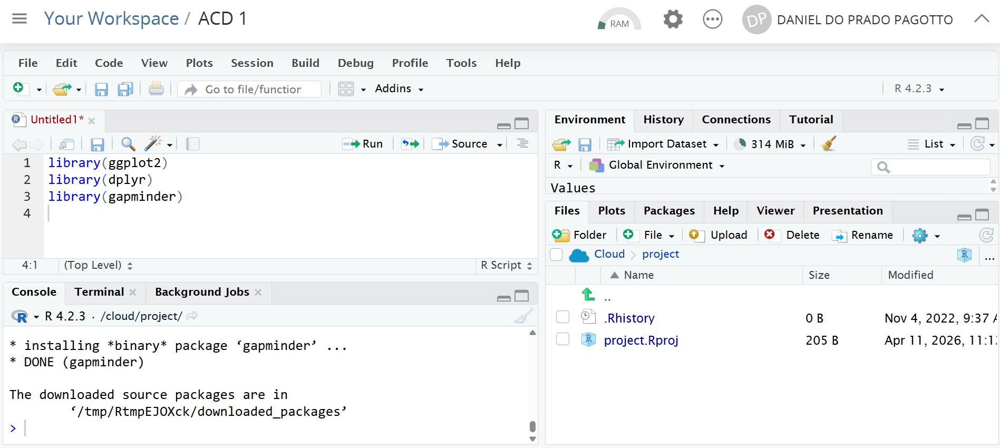
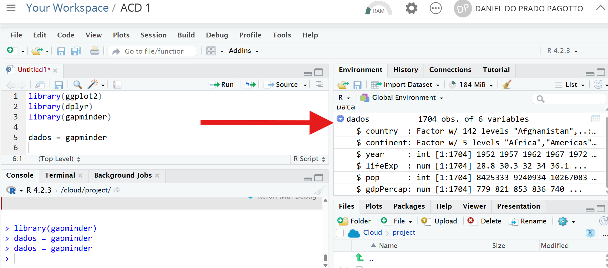

## Aula 1

Este material foi desenvolvido pelo Prof. Daniel Pagotto para a disciplina de Análise e Comunicação de Dados.

A primeira ferramenta de análise de dados que vamos aprender é a linguagem de programação R.

{fig-align="center" width="228"}

R também é uma linguagem de programação, assim como Python, que vocês estão aprendendo na disciplina de algoritmos.

Este documento tem algumas seções:

1.  A interface do RStudio (ou Posit Cloud);

2.  Fazendo operações básicas;

3.  Carregando os dados e realizando os primeiros tratamentos;

4.  Aplicação no R de tudo que vimos até agora na disciplina;

5.  Explorando os dados com o pacote de manipulação de dados `dplyr`.

## 1. A interface do RStudio/Posit Cloud

Professor, o que estes dois programas - RStudio e Posit Cloud - têm em comum?

-   *Comum*: os dois programas são apropriados para o uso do R;

E o que eles têm de diferente?

-   *Diferente*: o RStudio é a versão que você usa instalada no seu próprio computador e o Posit Cloud você usa no navegador (ex.: Google Chrome).

Você consegue acessar o Posit Cloud por meio deste [link](https://posit.cloud/). Basta fazer o login usando uma conta do google ou criar sua conta pelo email que quiser.

A carinha do Posit Cloud é esta.



Por enquanto, não vou explicar o que significa cada campo e botão da interface.

Sabe jogo de tabuleiro? Você lê as regras e não entende de primeira. Só depois de algumas rodadas do jogo que você realmente entende de fato como funciona. Aqui é igual.

{fig-align="center" width="339"}

Por hora, só quero que você faça algumas coisas:

1\) Clique em *"R Script"* conforme o print;



2\) O script será aberto conforme destacado de vermelho. Digite alguma operação como esta (1 + 2) e aperte **ctrl + enter**. Veja que o R vai executar a operação apresentando um resultado (output) lá embaixo.



> Já devem ter visto na disciplina de algoritmos, mas reforço aqui: pensem que um computador sempre vai fazer três coisas - receber uma entrada de dados, um processamento e uma saída. Neste pequeno trecho de código temos uma entrada `1 + 2`, um processamento (a operação sendo executada) e uma saída lá embaixo (o resultado da operação).

{fig-align="center" width="353"}

É muito importante que leia atentamente o material e reproduza o código no seu computador.

**Não copie e cole os trechos de código, DIGITE e rode os comandos. Isso é importante para o sucesso do seu aprendizado!**

## 2. Fazendo operações básicas

Antes de iniciar a análise de dados, vamos fazer algumas operações básicas.

## 2.1. Operações matemáticas

Como qualquer linguagem de programação, o R é uma calculadora.

Teste rodar algumas operações básicas e veja os resultados.

Lembre-se: coloque a operação e com o cursor em cima da linha e aperte **ctrl + enter** para rodar.

```{r}

1 + 6

5 * 2

8 - 15

16/2

5**2 

sqrt(36)

```

`sqrt` vem de *square root*, raiz quadrada em inglês.

A ordem de execução é semelhante da matemática! Multiplicação e divisão sempre virão antes. Porém, se você quiser definir outra ordem de execução, use parênteses. Veja abaixo.

```{r}

5 + 6 * 6 # a multiplicação ocorre primeiro

(5 + 6) * 6 #o 5 + 6 é executado primeiro e depois multiplicado
```

Note que na primeira operação teremos a multiplicação sendo executada primeiro, o que resulta 41.

Já na segunda operação temos a soma entre parênteses sendo executada antes, o que resulta em 66.

Suponha que a gente tenha cinco notas da disciplina de ACD, conforme a seguir, calcule a média.

| ID aluno | Nota |
|:--------:|:----:|
|    1     | 6,5  |
|    2     |  8   |
|    3     | 9,2  |
|    4     | 4,6  |
|    5     | 7,6  |

Vamos calcular a média.

**Atenção!** Você tem que usar **ponto (e [não]{.underline} vírgula)** para separar as casas decimais!

```{r}

(6.5 + 8 + 9.2 + 4.6 + 7.6)/5

```

> **Exercício 1:** Faça um exercício semelhante para calcular a média do conjunto de **notas** abaixo. Faça o cálculo e anote o resultado.

| ID aluno | Nota |
|:--------:|:----:|
|    6     |  7   |
|    7     | 9,7  |
|    8     | 4,2  |
|    9     | 6,6  |
|    10    | 7,2  |

## 2.2. Atribuições de variáveis

Assim como no Python, você pode atribuir valores a uma variável. A atribuição é útil para reaproveitar valores em operações.

Vamos fazer uma clássica operação: calcular o índice de massa corpórea.

```{r}

peso = 94
altura = 1.78

peso/(altura**2)

```

Eu posso inclusive guardar o resultado em uma nova variável.

```{r}

imcDaniel = peso/(altura**2)

```

> **Observação!** Ao criar nome de variáveis é importante se atentar a algumas regras!
>
> -   **Não** coloque palavras separadas (ex.: `imc Daniel`);
> -   **Não** coloque caracteres especiais, como acentos, cedilhas) (ex.: ao invés de `pesoConceição`, utilize `pesoConceicao`);
> -   O R é case sensitive. Ou seja, o nome de uma variável `imcDaniel` **é diferente** de `IMCDaniel`.

> **Exercício 2:** Faça o cálculo do seu IMC como exercício.

## 2.3. Carregando bibliotecas

Eu costumo fazer um paralelo que o R é como o Batman.

O Batman sozinho possui algumas habilidades? Ele sabe artes marciais e é muito inteligente. Afinal, é o detetive dos quadrinhos.

Mas o Batman não tem superforça, não tem velocidade. A habilidades dele vem dos equipamentos dele, né? O Batmóvel, o cinto de utilidades...

{fig-align="center" width="234"}

O R por si só possui algumas funcionalidades.

Mas ele ganha outra dimensão de utilidade quando você instala **pacotes** nele. Por exemplo, vamos ver um pacote de visualização de dados chamado `ggplot2`.

O R sozinho faz gráficos. Veja o boxplot abaixo. Foi feito sem nenhum pacote adicional.

```{r}
#| echo: false
#| message: false
#| warning: false

options(scipen = 999)

library(ggplot2)
library(dplyr)
library(gt)

df = gapminder::gapminder

df87 = df |> dplyr::filter(year == 1987)

boxplot(df87$lifeExp)

```

Mas eu posso fazer gráficos muito mais bonitos e customizados se eu usar pacotes de visualização de dados como o pacote `ggplot2`. Veja o gráfico abaixo.

```{r}
#| echo: false
#| message: false
#| warning: false

df87 = df |> dplyr::filter(year == 1987)

df87 |> 
  rename(Continente = continent) |> 
  ggplot(aes(y = lifeExp, fill = Continente)) +
  geom_boxplot() +
  theme_minimal() +
  xlab("Continente") +
  ylab("Idade") +
  ylim(0,100) +
  theme(axis.text.x = element_blank()) +
  ggtitle("Expectativa de Vida dos países em 1987",
          "Fonte: Gapminder")
  
```

### 2.3.1. Instalando um pacote

Tá! Mas como faz para instalar pacotes?

Lá na parte de baixo, você vai escrever o comando `install.packages("ggplot2")` e apertar Enter (Lá embaixo, no campo Console, basta você apertar Enter para ele executar!).

> -   O que esta linha de código significa? Você está usando o comando `install.packages()` para instalar o pacote que você quer, nesse caso, o ggplot2.

{fig-align="center"}

Quando você pede para instalar, vai notar um tanto de linha aparecendo aqui embaixo. Aguarde ele parar de trazer informação. Ao final, geralmente você vê algum texto do tipo "*The downloaded source packages are in...*".

Agora é sua vez! Faça o mesmo procedimento para instalar os seguintes pacotes: `skimr`, `dplyr` , `gt` e `gapminder` .

### 2.3.2. Carregando o pacote

Depois de instalar, você precisa carregar o pacote no seu código para conseguir usar as funcionalidades dele.

Como faz isso?

Você vai usar o comando `library` e o nome do pacote: `library(ggplot2)`, por exemplo. Depois clique em ctrl + Enter.



Carregue os pacotes que instalamos antes: `ggplot2`, `dplyr` , `gt` , `skimr` e `gapminder`.

## 2.4. Comentários

Sempre que tiver um \# no código, o R entende que temos um comentário e, portanto, ele não executa a linha, ou seja, ele pula a linha.

Fazer comentários ao longo do código é uma boa prática para que outras pessoas entendam o que você está fazendo.

```{r}

# calcula a média de um conjunto de dados 

media_teste = mean(c(7, 2, 6, 9))

# calcula a correlação entre dois conjuntos de dados

correlacao_teste =  cor(c(7, 2, 6, 9),
                  c(1, 4, 9, 3))

# imprime o resultado das operacoes
media_teste
correlacao_teste

```

**Pronto! Agora a parte legal começa!**

{fig-align="center" width="154"}

## 3. Carregando os dados e realizando os primeiros tratamentos

Nós vamos trabalhar com uma base de dados chamada gapminder.

Esta base foi desenvolvida por um instituto chamado [Gapminder](https://www.gapminder.org/). Em tradução livre retirada do site:

> *"A Gapminder é uma fundação sueca independente, sem vínculos políticos, religiosos ou econômicos.*
>
> *O Gapminder identifica equívocos sistemáticos sobre tendências e proporções globais importantes e usa dados confiáveis ​​para desenvolver materiais didáticos fáceis de entender, a fim de livrar as pessoas desses equívocos."*

Vamos acessar um conjunto de dados (dataset) que está no pacote gapminder e salvar em um objeto que chamaremos de dados. Obs.: não esqueça de apertar ctrl + enter para rodar a linha.

```{r}

dados = gapminder::gapminder

```

> -   O que estou fazendo?
> -   Estou falando: R, acesse um conjunto de dados chamado `gapminder` que está dentro do pacote `gapmider` ;
> -   Guarde o conjunto de dados em um objeto que eu vou chamar de `dados`.

Para dar uma primeira conferida nos dados, use a função `head()`. Ela mostra as seis primeiras linhas do conjunto de dados.

Note que os primeiros registros são do país Afeganistão, que fica na Ásia. Cada 5 anos houve uma coleta: 1952, 1957, 1962...

```{r}

head(dados)
```

Você também pode usar a função `glimpse()` para ver um resumo da estrutura dos dados — quais colunas existem e que tipo de informação cada uma guarda.

```{r}

glimpse(dados)

```

> -   Temos 1704 observações (linhas) e 6 variáveis (colunas);
> -   `country` = país, `continent` = continente, `year` = ano, `lifeExp` = expectativa de vida, `pop` = população, `gdpPercap` = PIB per capita;
> -   Note também que existem o tipo da variável ao lado do nome.
>     -   Variáveis do tipo `fct`: qualitativas;
>     -   Variáveis do tipo `dbl:` quantitativas contínuas;
>     -   Variáveis do tipo `int:` são quantitativas contínuas.

**Atenção!** É muito importante inspecionar seus dados e entender bem o que significam. Uma das fontes básicas - além do próprio conjunto de dados - é o dicionário de dados. Lembra da aula do dia 06/04 que vimos os dicionários de algumas bases?

Uma última forma de inspecionar os dados é por meio da janela *Environment*. Clicando sobre a setinha azul, será aberto um pequeno recorte do conjunto de dados.



## 4. Tudo que vimos no quadro

Essa seção é bem rápida. Sabe tudo que vimos no quadro, calculado a mão? Essa seção resolve.

No quadro trabalhamos com conjuntos de dados bem pequenos (10 números no máximo).

Mas e seu eu tiver centenas, milhares ou milhões e registros? É humanamente impossível fazer na mão. Então usamos o software para resolver.

```{r}
#| include: false
library(skimr)
dados_2002 = dados |> filter(year == 2002)

```

Separei o seguinte conjunto de dados que possui registros para o ano de 2002. O conjunto tem 142 observações.

```{r}

glimpse(dados_2002)
```

Vamos calcular as medidas resumo.

Sabe aquele tanto de cálculo de média, quartil, mediana, desvio-padrão que fizemos na mão? Uma linha de código resolve tudo.

Olha a saída (output) da função. Veja a última tabela. Temos a média (mean), o desvio-padrão (sd), o mínimo (p0), máximo (p100), 1º quartil (p25), mediana/2º quartil (p50), 3º quartil (p75).

```{r}

skim(dados_2002)

```

Vamos aplicar uma correlação entre duas variáveis: expectativa de vida (`lifeExp`) e PIB per capita (`gdpPercap`). Uma linha resolve! Existe uma associação positiva de 0,68 aproximadamente.

```{r}

cov(dados_2002$lifeExp, 
    dados_2002$gdpPercap)

cor(dados_2002$lifeExp, 
    dados_2002$gdpPercap)

```

Professor! PIDoucas linhas de código resolvem tudo aquilo que vimos? Sim! Mas temos que sedimentar bem os conceitos e só fazendo manualmente que conseguimos alcançar um bom aprendizado.

## 5. Explorando os dados com o `dplyr`

O `dplyr` é um dos pacotes mais usados em R para tratamento e manipulação de dados. Ele oferece funções simples e diretas que, combinadas, permitem fazer análises poderosas.

Pense no `dplyr` como um canivete suíço: cada ferramenta tem uma função específica e você vai combinando elas conforme a necessidade.

As principais funções que vamos aprender são:

| Função        | O que faz                             |
|---------------|---------------------------------------|
| `select()`    | Seleciona **colunas**                 |
| `rename()`    | Renomeia **colunas**                  |
| `filter()`    | Filtra **linhas** por uma condição    |
| `arrange()`   | **Ordena** as linhas                  |
| `group_by()`  | **Agrupa** os dados por uma categoria |
| `summarise()` | **Resume** os dados com estatísticas  |
| `mutate()`    | **Cria** uma nova variável            |

Vamos ver cada uma delas!

## 5.1. `select()` — Escolhendo colunas

Às vezes, a base de dados tem muitas variáveis e você só precisa de algumas. O `select()` serve para isso.

```{r}
# Selecionando apenas país, ano e expectativa de vida

dados |> 
  select(country, year, lifeExp)
```

> **Dica!** Você também pode usar `select()` para **remover** uma coluna colocando um `-` antes do nome dela.

```{r}
# Removendo a coluna pop e guardando em um novo objeto chamado dados_sem_pop. 
#Veja que agora não temos mais a variável pop

dados_sem_pop = dados |> 
                  select(-pop)

glimpse(dados_sem_pop)
```

> **Exercício 3:** selecione apenas as colunas `country`, `year`, `continent` e `gdpPercap` e armazene em um novo conjunto de dados chamado dados_2. Depois inspecione para saber se a variável permanece lá.

## 5.2. `filter()` — Filtrando linhas

O `filter()` permite que você fique apenas com as linhas que atendem a uma condição. Sempre use dois sinais de =.

```{r}
# Apenas os dados do Brasil
dados |>
  filter(country == "Brazil")
```

Se você quiser pegar todos os países, com exceção daqueles que são do continente Ocenia, basta usar o operador `!=` que significa "diferente".

```{r}

dados |> 
  filter(continent != "Oceania")

# note que vai falar que temos 1680 linhas agora e não 1704
```

Você pode combinar condições usando `&` (E) e `|` (OU):

```{r}
# Brasil E ano maior que 2000
dados |> 
  filter(country == "Brazil" & year > 2000) # operador E
```

Ao usar o E (&) para filtrar, mantemos apenas os registros que **satisfazem a intersecção das duas condições**. Ou seja, se o país é Brasil e o ano é superior a 2000.

```{r}
# Países da América OU Asia
dados |> 
  filter(continent == "Americas" | 
         continent == "Asia") # Operador OU
```

Ao usar o OU (\|) para filtrar, mantemos os registros que satisfazem uma OU outra condição. Ou seja, o continente é Americas OU o continente é Asia.

> -   Para comparar valores de texto, use aspas (`"Brazil"`). Para números, não precisa (`year > 2002`).
> -   Se você quiser pegar anos maiores que 2002, você terá que colocar `year > 2002`. Porém, se quiser pegar **inclusive** o ano 2002, terá que usar o operador `>=`, ou seja, `year >= 2002`.
> -   E lembre-se: comparação de igualdade usa **dois sinais de igual** (`==`), não um só!

> **Exercício 4:** filtre os dados para mostrar apenas países da **África** (`Africa`) no ano de **2007** e armazene em um novo objeto.

## 5.3. O pipe `|>` — Encadeando operações

O **pipe** é um operador famoso no R. Você já viu ele acima e é escrito como `|>`. Ao invés de escrevê-lo você pode usar o atalho dele que é `ctrl + shift + m`).

Ele serve para **encadear** operações, ou seja, passar o resultado de uma função diretamente para a próxima. Isso evita criar um monte de variáveis intermediárias e deixa o código muito mais legível.

Pense assim: o pipe significa **"e então...".** Veja abaixo o encademando de duas operações: `select()` e `filter()`.

```{r}

exp_vida_2007 = 
  dados |> 
  select(country, year, lifeExp) |> 
  filter(year == 2007)
```

## 5.4. `arrange()` — Ordenando os dados

O `arrange()` ordena as linhas de acordo com uma coluna. Por padrão, ele ordena do menor para o maior.

```{r}
# Ordenando por expectativa de vida (do menor para o maior)
dados |> 
  filter(year == 2007) |> 
  arrange(lifeExp)
```

Para ordenar do **maior para o menor**, use `desc()`:

```{r}
# Os países com maior expectativa de vida em 2007
dados |> 
  filter(year == 2007) |> 
  arrange(desc(lifeExp))
```

> **Exercício 5:** quais eram os 5 países com **menor PIB per capita** em 1952? Use `filter()` e `arrange()` para descobrir.

## 5.5. `summarise()` — Resumindo os dados

O `summarise()` permite calcular estatísticas resumidas da base de dados, como média, soma, mínimo e máximo.

```{r}
# Calculando a média global de expectativa de vida em 2007
dados |> 
  filter(year == 2007) |> 
  summarise(media_expectativa = mean(lifeExp))
```

Você pode calcular várias estatísticas ao mesmo tempo:

```{r}
dados |> 
  filter(year == 2007) |> 
  summarise(
    media_expectativa = mean(lifeExp),
    mediana_expectativa = median(lifeExp),
    q1_expectativa = quantile(lifeExp, probs = 0.25),
    q3_expectativa = quantile(lifeExp, probs = 0.75),
    dp_expectativa = sd(lifeExp),
    menor_expectativa = min(lifeExp),
    maior_expectativa = max(lifeExp),
  )
```

> **Exercício 6.** Filtre apenas os países das Americas do ano de 2002 e faça as estatísticas básicas: média, mediana, quartis 1 e 3, desvio-padrão.
>
> **Exercício 7.** Filtre apenas os países da Ásia do ano de 2002 e e faça as estatísticas básicas: média, mediana, quartis 1 e 3, desvio-padrão.
>
> **Exercício 8.** Com base nas estatísticas básicas, interprete os resultados.

## 5.6. `group_by()` + `summarise()` — A dupla poderosa

O `group_by()` sozinho não faz muita coisa. A magia acontece quando você o combina com o `summarise()`. Juntos, eles calculam estatísticas **por grupo**.

Por exemplo: e se eu quiser saber a média de expectativa de vida **por continente**?

```{r}
dados |> 
  filter(year == 2007) |> 
  group_by(continent) |> 
  summarise(media_expectativa = mean(lifeExp))

```

> O que estou fazendo aqui?
>
> -   Pegando o objeto chamado dados, filtrando para pegar apenas os registros de 2007.
> -   Em seguida, peço para agrupar todos os registros, cuja variável `continent` seja igual.
> -   Por fim, aplico uma média (`mean`) na variável lifeExp e armazeno em uma nova variável que vou chamar de `media_expectativa`.

Você pode inclusive ordenar o resultado para ficar mais apresentável:

```{r}
dados |> 
  filter(year == 2007) |> 
  group_by(continent) |> 
  summarise(media_expectativa = mean(lifeExp)) |> 
  arrange(desc(media_expectativa)) 
```

**O que aconteceu aqui?** Pegamos os dados de 2007, agrupamos por continente e calculamos a média de expectativa de vida de cada grupo. O `arrange()` no final só organizou o resultado do maior para o menor.

Uma última coisa legal que você pode fazer para deixar sua tabelinha ainda mais bonita é usar a função `gt()`. Esta função faz parte do pacote gt que você carregou lá em cima em `library(gt)`.

```{r}

dados |> 
  filter(year == 2007) |> 
  group_by(continent) |> 
  summarise(media_expectativa = mean(lifeExp)) |> 
  arrange(desc(media_expectativa)) |> 
  gt()

```

Além de sumarizar os resultados usando medidas de tendência central, posição ou variação. Você pode usar o `group_by` e `summarise` para fazer algumas contagens. Quero saber quantos países no ano de 2002 temos em cada continente.

```{r}

dados |> 
  filter(year == 2002) |> 
  group_by(continent) |> 
  summarise(total = n()) 

```

> **Exercício 9:** usando os dados de **1952 e 2007**, calcule a média de PIB per capita (`gdpPercap`) por continente nos dois anos. Apresente os resultados com a tabela estilizada usando a função `gt()`. O que mudou ao longo do tempo?
>
> *Dica: você pode usar `filter(year == 1952 | year == 2007)` e depois agrupar por `continent` e `year`.*

## 5.7. A função `rename()`

Você pode renomear as variáveis. Vamos supor que ao invés de trabalhar com as variáveis em inglês, você queira trabalhar com elas em português. Como renomear?

```{r}

dados_pt = dados |> 
            rename(pais = country, 
                   continente = continent,
                   ano = year, 
                   ExpVida = lifeExp, 
                   Populacao = pop, 
                   PIB_percapita = gdpPercap)

glimpse(dados_pt)

```

Veja que os nomes das variáveis agora estão conforme você mudou.

A função `rename()` é muito útil quando você tem variáveis expressas em códigos. Uma das bases que sugeri trabalhar se chama Munic. Nela as variáveis estão em códigos (ex.: VAR1010). Vale a pena renomear as variáveis nesses casos.

## 5.8. Criando uma nova variável usando mutate()

Você quer criar uma nova variável que representa o PIB.

O PIB é o resultado da multiplicação da População pelo PIB per capita. Vamos chamar esta nova variável de `GDP` (*Gross Domestic Product,* Produto Interno Bruto ou PIB em inglês).

Como o PIB é um número muito algo, vamos criar uma nova variável chamada `log_GDP`. Essa basicamente é uma transformação logarítimica na base 10. Além disso, apliquei um arredondamento de três casas decimais por meio da função `round`.

Tudo isso foi armazenado num novo objeto chamado `dados_PIB`.

Inspecione como ficou com a função `glimpse`.

```{r}

dados_PIB = dados |> 
  mutate(GDP = pop * gdpPercap) |> 
  mutate(log_GDP = round(log10(GDP),3)) 

glimpse(dados_PIB)

```

Vamos criar uma nova variável para designar os países que em 2007 possuíam mais de 75 milhões de habitantes.

```{r}

dados |> 
  filter(year == 2007) |> 
  mutate(pop_75 = if_else(pop > 75000000, 
                          "Superior a 75 milhões",
                          "Igual ou inferior a 75 milhões")) |>
 select(country, pop, pop_75)

```

> **Exercício 10.** Acesse apenas os dados de 2002 e crie uma nova variável para designar os países que nesse ano possuíam mais que a mediana da população. Ou seja, se o valor for superior à mediana, a nova variável vai receber uma categoria chamada "Acima da mediana". Caso contrário, vai receber um valor de "Abaixo da mediana".

Lá em cima fizemos a contagem de países por continente no ano de 2002, certo?

Vamos criar uma nova variável chamada proporcao. Ao invés de apresentar os resultados em valores absolutos, vamos ver em termos percentuais.

```{r}

dados |> 
  filter(year == 2002) |> 
  group_by(continent) |> 
  summarise(total = n()) |> 
  mutate(proporcao = total / sum(total)) |> 
  mutate(proporcao = round(proporcao, 3))

```

> **Exercício 11.** Faça a contagem e a proporção de países em 1952 e veja se são iguais que em 2002.

Vamos agora criar uma nova variável, chamada `status_pop`, que segue a seguinte lógica:

-   Se a população for maior que o terceiro quartil, então a variável recebe a categoria "Muito alta";

-   Se a população estiver entre a mediana e o terceiro quartil, então a variável recebe a categoria "Alta";

-   Se a população estiver entre o primeiro quartil e a mediana, então a variável recebe a categoria "Média";

-   Se a população estiver abaixo do primeiro quartil, então a variável recebe a categoria "Baixa".

Armazene o resultado desta operação em um novo objeto chamado `dados_pop`. Para fazer isso, usaremos uma estrutura condicional chamada `case_when()`.

```{r}

status_pop = 
  dados |> 
  filter(year == 2002) |> 
  mutate(status_pop =
           case_when(
                     pop >= quantile(pop, 0.75) ~ "Muito Alta",
                     pop < quantile(pop, 0.75) & 
                     pop >= quantile(pop, 0.5) ~ "Alta",
                     pop < quantile(pop, 0.5) &
                     pop >= quantile(pop, 0.25) ~ "Média",
                     pop < quantile(pop, 0.25) ~ "Baixa"
         )) |> 
  select(country, pop, status_pop)

status_pop

```

## 6. Lista final

Vamos ler um conjunto de dados para fins de exercício agora. O conjunto de dados está armazenado em um objeto chamado `cnes`.

```{r}
#| echo: true
#| message: false
#| warning: false

cnes = vroom::vroom("https://raw.githubusercontent.com/danielppagotto/ACD-UFG/refs/heads/main/02_dados/cnes_pf.csv")

```

a\) Inspecione a novo conjunto de dados. Quantas linhas e colunas temos?

b\) Selecione apenas as colunas `municipio`, `categoria` e `numero_prof_padronizado` e armazene em um novo objeto chamado `dados_resumido`. Depois, inspecione o resultado com `glimpse()`.

c\) Renomeie a variável `numero_prof_padronizado` para `num_profissionais`. Sobrescreva o objeto, armazendo num objeto de mesmo nome.

d\) Filtre a base para manter apenas os registros do município de **Luziânia** e armazene em um novo objeto. Quantas linhas esse novo objeto possui?

e\) Filtre a base para mostrar apenas os registros que atendam **simultaneamente** às seguintes condições: ano igual a 2023 e nível atenção igual à primária;

f\) Filtre os dados para o ano de 2019, e nível de atenção primária e calcule as seguintes estatísticas sobre a variável `num_profissionais`: Média, Mediana, Desvio-padrão, Valor mínimo, Valor máximo.

g\) Agrupe os dados por `municipio` e `categoria profissional` e calcule, para todos os anos disponíveis, a **soma total** de profissionais padronizados por município. Ordene o resultado do maior para o menor e apresente com a função `gt()`.

h\) Filtre os dados para o ano de **2023** e crie uma nova variável chamada `porte`, seguindo a lógica abaixo com base em `numero_prof_padronizado`:

-   Acima do 3º quartil → `"Grande"`

-   Entre a mediana e o 3º quartil → `"Médio"`

-   Entre o 1º quartil e a mediana → `"Pequeno"`

-   Abaixo do 1º quartil → `"Muito Pequeno"`

Selecione apenas as colunas `municipio`, `categoria`, `numero_prof_padronizado` e `porte` e exiba o resultado.
